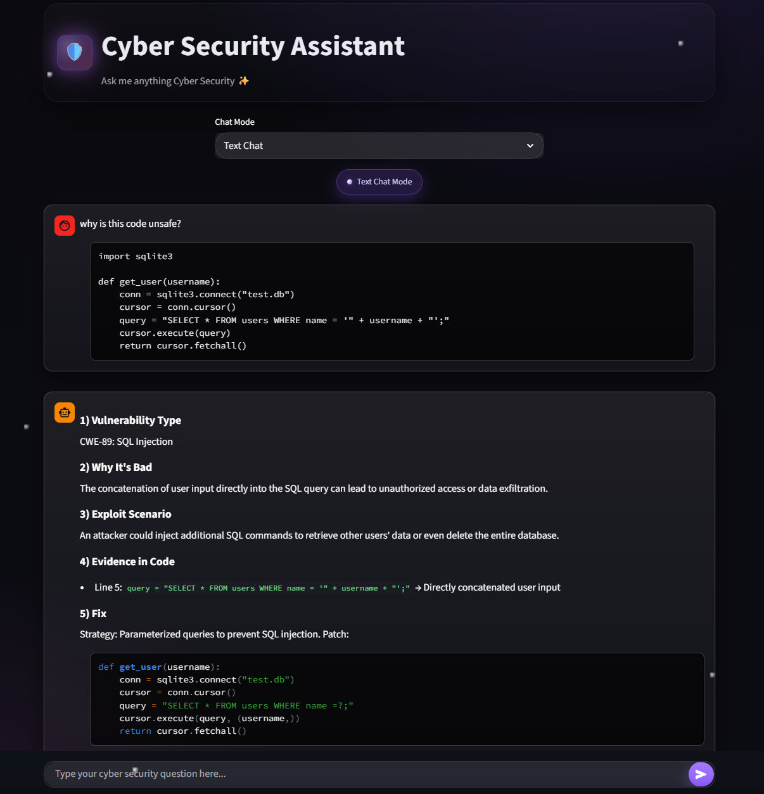

# JAA - Cybersecurity AI Agent



## Overview

JAA is an intelligent cybersecurity assistant powered by advanced AI technologies. This agent is designed to help security professionals and developers with code vulnerability analysis, security theory knowledge, and cybersecurity best practices through natural language interactions.

## Project Details

### Core Technologies

- **Fine-tuned Language Model**: Built on Qwen2.5 14B with QLoRA (Quantized Low-Rank Adaptation) fine-tuning specifically trained on cybersecurity code datasets
- **RAG (Retrieval-Augmented Generation)**: Powered by LlamaIndex and ChromaDB for efficient retrieval of cybersecurity theory knowledge and documentation
- **Agent Architecture**: Implemented using LangGraph for intelligent routing and multi-agent orchestration
- **High-Performance Inference**: Utilizes vLLM for optimized LLM inference with significant speed improvements

### Key Features

- **Code Vulnerability Analysis**: Identify and explain security vulnerabilities in code
- **Security Knowledge Base**: Access comprehensive cybersecurity theory through RAG
- **Intelligent Routing**: Automatically routes queries to specialized handlers (Notion, ArXiv search, vulnerability checks)
- **Optimized Performance**: Fast inference times with vLLM on Unix systems

## Installation & Setup

### Prerequisites

- Python 3.10+
- CUDA-capable GPU (recommended)
- Unix-based system for vLLM (Linux/macOS) or Windows for fallback mode

### Step 1: Install Dependencies and Build RAG Index

Run the installation script to install all Python packages and build the RAG database:

```bash
./llm/install.sh
```

This script will:
1. Install all required Python packages from `requirements.txt`
2. Build the RAG vector database from your knowledge base

### Step 2: Run the Backend Server

#### For Cloud/Server GPU Deployment (14B Model):

```bash
python ./llm/server_api.py server
```

This will load the Qwen2.5-14B model with LoRA adapter for production use.

#### For Local Testing (3B Model):

```bash
python ./llm/server_api.py
```

Running without the `server` argument will use the lighter 3B model on localhost for testing purposes.
vLLM will not work on Windows OS, and it will automatically fall back to use the slower pipeline.

### Step 3: Launch the Frontend

Start the Streamlit interface:

```bash
streamlit run ./llm/front_end/streamlit_app.py --server.port=9000
```

Access the application at `http://localhost:9000`

## Usage

Once the frontend is running, you can:
- Ask questions about cybersecurity concepts
- Submit code for vulnerability analysis
- Query security documentation through the RAG system
- Get assistance with security best practices

## Architecture

```
User Input → LangGraph Router → [Vulnerability Check | RAG Search | Notion | ArXiv]
                                            ↓
                                    Qwen2.5 14B (LoRA)
                                            ↓
                                    Generated Response
```

## Notes

- **GPU Memory**: The 14B model requires significant GPU memory (~28GB). Use the 3B model for local testing on consumer GPUs.
- **Platform Support**: vLLM (high-performance mode) works on Linux/macOS. Windows automatically falls back to transformers pipeline.
- **RAG Database**: Ensure the RAG database is built before running queries that require knowledge retrieval.
